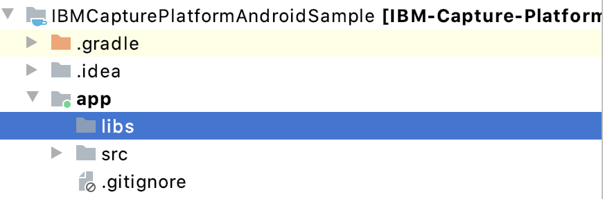
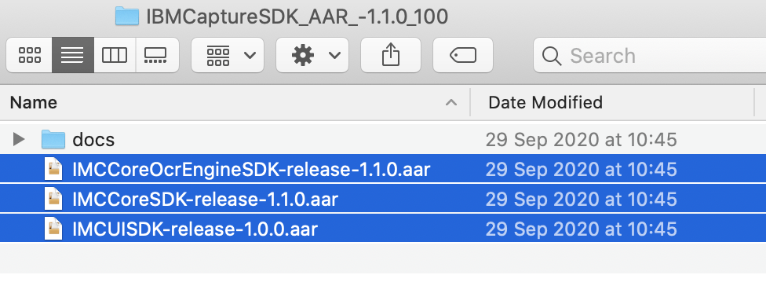
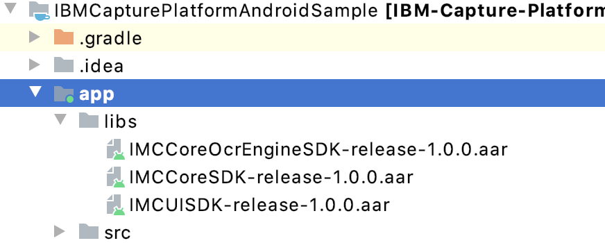
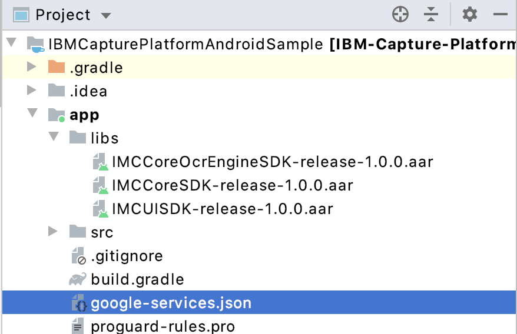

# Mobile Capture SDK - Developer Guide

## About

The Mobile Capture SDKs are a set of native Android frameworks that allow you to integrate *IBM Automation Mobile Capture* in your existing mobile app or to create a highly customised application from scratch.

## Table of contents
- [Requirements](#requirements)
- [Integration](#integration)
    - [Adding Mobile Capture dependency](#mobile-capture-dependency)
    - [Adding Proguard rules](#proguard-rules)
    - [Adding Firebase dependency](#firebase-dependency)
- [Capture](#capture)
    - [Example](#example)
- [Authentication](#authentication)
- [Download Data](#download-data)
- [Upload Results](#upload-results)

<a name="requirements"></a>
## Requirements

The Mobile Capture SDKs require Android 7.0 or later, as the minimum OS version.

<a name="Integration"></a>
## Integration

The Mobile Capture SDK is divided in three different Android Archive (AAR) libraries to allow a more lightweight integration for those customers, who do not  need all the functionality. The following three (AAR) libraries with functions: 

- `IMCCoreSDK`: this SDK contains the models and the network layer. This SDK is required to use any of the other three. 
- ` IMCUISDK`: this SDK contains the `Fragments` used to capture data from the camera and review the results.
- `IMCCoreOcrEngineSDK`: This SDK contains the logic to perform OCR for a given image.

<a name="mobile-capture-dependency"></a>
### Adding Mobile Capture dependency

To add the Mobile Capture dependency, do the following steps:

1. Set the application minSdkVersion to API level 24 (Android 7.0)

```
android {
	defaultConfig {
	...
        minSdkVersion 24
	...
    }
}
```

2. If you don not  have a `libs` directory, create one on your project window:


3. Get the needed SDKs:


4. Drag and drop the needed SDKs to the libs group:


5. The following code should be added to the project-level build.gradle in order to use the SDK libraries:

```
buildscript {
	...
    ext.kotlin_version = '1.2.51'
    ...

    dependencies {
    	 ...
        classpath 'com.android.tools.build:gradle:3.2.1'
        classpath "org.jetbrains.kotlin:kotlin-gradle-plugin:1.2.51"
        classpath "com.google.gms:google-services:4.2.0"
        classpath "io.realm:realm-gradle-plugin:5.8.0"
        ...
    }
}
```

6. There are a few dependencies needed to be added to the app-level build.gradle in order to use the SDK libraries:

```
apply plugin: 'com.google.gms.google-services'
apply plugin: 'kotlin-kapt'
apply plugin: 'realm-android'

android {
	...
    compileOptions {
        sourceCompatibility JavaVersion.VERSION_1_8
        targetCompatibility JavaVersion.VERSION_1_8
    }
	... 
}

dependencies {
	...
    implementation fileTree(dir: 'libs', include: ['*.jar', '*.aar'])
    implementation "org.jetbrains.kotlin:kotlin-stdlib-jdk7:$kotlin_version"
    implementation 'androidx.appcompat:appcompat:1.2.0'
    implementation 'androidx.core:core-ktx:1.3.2'
    implementation 'androidx.constraintlayout:constraintlayout:2.0.2'
    implementation 'com.google.android.material:material:1.0.0'

    implementation 'org.jetbrains.anko:anko-common:0.9'
    implementation "com.google.firebase:firebase-ml-vision:24.0.3"
    implementation 'com.rmtheis:tess-two:7.0.0'
    implementation 'com.jakewharton.timber:timber:4.7.1'
    implementation "com.github.bumptech.glide:glide:4.8.0"

    implementation 'online.devliving:securedpreferencestore:0.7.4'

    implementation('com.squareup.retrofit2:retrofit:2.3.0') {
        exclude module: 'okhttp'
    }
    implementation 'com.squareup.okhttp3:okhttp:3.14.9'
    implementation 'com.squareup.okhttp3:okhttp-urlconnection:3.14.9'
    implementation 'com.squareup.okhttp3:logging-interceptor:3.14.9'
    implementation 'com.squareup.retrofit2:converter-gson:2.3.0'
    implementation 'com.squareup.retrofit2:adapter-rxjava2:2.3.0'
    implementation 'io.reactivex.rxjava2:rxjava:2.2.19'
    implementation 'io.reactivex.rxjava2:rxandroid:2.1.1'
    implementation 'androidx.exifinterface:exifinterface:1.0.0'

    implementation 'android.arch.work:work-runtime:1.0.0-alpha11'
    ...
}
``` 

7. Edit the distributionUrl in the gradle-wrapper.properties:

```
...
distributionUrl=https\://services.gradle.org/distributions/gradle-5.4.1-all.zip
...
``` 

<a name="proguard-rules"></a>
### Adding Proguard rules

- In order to run you app using proguard with obfuscation turned on, add the following proguard rules to your app (Example file added):

``` 
-ignorewarnings

-keep class com.ibm.capture.sdk.**{ *; }
-keep public class com.ibm.capture.sdk.ui.capture.CaptureCameraView { public *; }
-keep public interface com.ibm.capture.sdk.ui.capture.CaptureCameraView$* { *; }

-keep class com.ibm.capture.sdk.ui.steps.StepFragmentFactory { *; }
-keep class com.ibm.capture.sdk.ui.steps.StepFragmentFactory$* { *; }

-keep class com.ibm.capture.sdk.ui.FragmentFactory { *; }
-keep class com.ibm.capture.sdk.ui.FragmentFactory* { *; }

-keep class com.ibm.capture.sdk.ui.steps.StepOutputListener { *; }
-keep class com.ibm.capture.sdk.ui.steps.StepOutputListener$* { *; }

-keep class com.ibm.capture.sdk.ui.steps.BaseStepFragment { *; }
-keep class com.ibm.capture.sdk.ui.steps.BaseStepFragment$* { *; }

-keep interface com.ibm.capture.sdk.ui.manual.** { *; }
-keep class com.ibm.capture.sdk.ui.manual.** { *; }

-keep class com.ibm.capture.sdk.processors.api.FrameProcessorCallback { *; }
-keep class com.ibm.capture.sdk.ui.steps.barcode.** { *; }
-keep class com.ibm.capture.sdk.processors.GraphicOverlay { *; }

-keep class com.ibm.capture.sdk.processors.image.CaptureImageProcessor { *; }
-keep class com.ibm.capture.sdk.processors.image.CaptureImageProcessor.** { *; }
-keep class com.ibm.capture.sdk.processors.image.CaptureImageProcessor$* { *; }
-keep class com.ibm.capture.sdk.processors.passport.** { *; }
-keep class com.ibm.capture.sdk.processors.passport$* { *; }

-keep class com.ibm.capture.sdk.ui.manual.** { *; }
-keep class com.ibm.capture.sdk.ui.steps.** { *; }

-keep class com.ibm.capture.sdk.ui.manual.ChooseTextInImageFragment { *; }
-keep class com.ibm.capture.sdk.ui.model.** { *; }

-keep public class * implements com.bumptech.glide.module.GlideModule
-keep public class * extends com.bumptech.glide.module.AppGlideModule
-keep public enum com.bumptech.glide.load.ImageHeaderParser$** {
  **[] $VALUES;
  public *;
}

-keep public interface com.ibm.capture.sdk.processors.ocr.IOcrEngine { *; }
-keep public interface com.ibm.capture.sdk.processors.ocr.IOcrEngineCallback { *; }
-keep public class com.ibm.capture.sdk.processors.ocr.OcrText { *; }
-keep public class com.ibm.capture.sdk.ocr.MrzOcrEngine { *; }
-keep public class com.ibm.capture.sdk.ocr.TextOcrEngine { *; }
-keep public class com.ibm.capture.sdk.processors.internal.FirebaseOcrDetector { *; }
-keep interface com.ibm.capture.sdk.processors.internal.FirebaseOcrDetector$* { *; }

-keepattributes InnerClasses

-keep class **.R
-keep class **.R$* {
    <fields>;
}

-keep class com.ibm.capture.sdk.core.processors.R$string { *; }

-keepclasseswithmembers class * {
    native <methods>;
}
```
   

<a name="firebase-dependency"></a>
### Adding Firebase dependency
 
All apps that use IMCUISDK, or IMCCoreOcrEngineSDK libraries must  have a Firebase application configuration. Follow this [link](https://firebase.google.com/docs/android/setup) if you need to set up a new Firebase application.

The google-services.json that is downloaded from the Firebase console, needs to be placed inside your app-level module folder:



If disabling automatic Firebase Analytics required, add the following values in your app's AndroidManifest.xml in the application tag:

``` xml
<meta-data android:name="firebase_analytics_collection_deactivated" android:value="true" />
<meta-data android:name="google_analytics_adid_collection_enabled" android:value="false" />
<meta-data android:name="google_analytics_ssaid_collection_enabled" android:value="false" />
```

The following should be added to the project-level build.gradle in order to use the SDK libraries of Firebase:

```
buildscript {

    dependencies {
    	 ...
        classpath "com.google.gms:google-services:4.2.0"
        ...
    }
}
```

<a name="capture"></a>
## Capture
In order to capture information, you must use `IMCUISDK` and choose the appropriate `Fragment` for your needs and add it to your Activity.

The `Fragment`s are `BaseStepFragment`s that are created by calling `StepFragmentFactory`'s `getFragmentForStep()` (Which is created by calling `FragmentFactory().getStepFragmentFactory()`) and passing a the appropriate `Step` and `Session` objects. Since the required `Step`s and `Session`s objects are created using parameters retrieved from a server, you can set your own values if you are not connecting to a server that would return you the correct instances.

`ChooseTextInImageFragment` (Which is not a server step type) is created by calling `StepFragmentFactory`'s `getChooseTextInImageFragment()`

Note that in order to create the `PassportCaptureStepFragment` and `ChooseTextInImageFragment` fragments also requires an OCR engine object for detecting the text from an image, which is created from `IMCCoreOcrEngineSDK` or from your own implementation of the `IOcrEngine` interface.

After creating the fragment, you need to set an object that implements `StepOutputListener` interface,  receives callbacks from the fragment of the captured images and extracted data. Once the callback is called, you can update the UI and remove the `BaseStepFragment`.

- **US Drivers License**: Used to capture the front and back of a US drivers license. The required `Fragment` is called `CaptureDriverLicenseStepFragment`. To instantiate this `BaseStepFragment` you must pass an instance of type `DriverLicenseStep`. After you finished capturing the driver's license and confirm the capture, the `onSuccess` callback  is called containing the captured images.

- **Passport**: Used to capture a passport. The `Fragment` needed is called `PassportCaptureStepFragment`. To instantiate this `BaseStepFragment` you must pass an instance of type `PassportStep`. After you finished capturing the passport, the data extraction  is successful and you need to confirm the capture. The `onSuccess()` callback is called with the output of the operation. It contains the image and the extracted data.

- **Barcode**: Used to capture a barcode. The required `Fragment` is called `BarcodeCaptureStepFragment`. To instantiate this `BaseStepFragment` you must pass an instance of type `BarcodeStep`. After you finished scanning the barcode, the `onSuccess()` callback is called containing the extracted data.

- **Document**: Used to capture a document that can have one or more pages. The required `Fragment` is called `MultipageDocumentStepFragment`. To instantiate this `BaseStepFragment` you must pass an instance of type `MultipageDocumentStep`. After you capture and accept all the multiple captures, the `onSuccess()` callback is called with the captured image. You can set the `MultipageDocumentStep` to show a confirmation screen after each capture by setting the Constructor parameter `presentCaptureConfirmation = true`.

- **Page Inspector**: Used to capture a page from a document. The required `Fragment`  is called `DocumentCaptureStepFragment`. To instantiate this `BaseStepFragment` you must pass an instance of type `DocumentStep`. After you finished capturing the page of the document and confirms the capture, the `onSuccess` callback  is called containing the captured image.

- **Photo**: Used to capture a photo. The required `Fragment` is called `PhotoCaptureStepFragment`. To instantiate this `BaseStepFragment` you must pass an instance of type `PhotoStep`. After you captured an image and confirms the capture, the `onSuccess` callback  is called with the captured image.

- **Choose text from image**: Used to capture text from a provided image. This is not a `BaseStepFragment` and is not a type that can be retrieved from a server. The required `Fragment` is called `ChooseTextInImageFragment`. As mentioned before, instantiated by calling `StepFragmentFactory`'s `getChooseTextInImageFragment()`) and passing the image path to be processed and an OCR engine object. It returns the text extraction results via `ManualChooseTextActivityCallback`'s `onFieldTextChanged(input: String)` via the caller activity. For example:

```
val textOcrEngine = TextOcrEngine()
val fragment = FragmentFactory().getChooseTextInImageFragment(imageFilePath, textOcrEngine)
```

As these fragments use the camera of the device, your app should request the user for a camera. Add the following to the AndroidManifest.xml:
```
...
<uses-permission android:name="android.permission.CAMERA"/>
...
    <application>
```

Request the permission before showing the fragments, using the Android runtime permissions framework: [Request App Permissions](https://developer.android.com/training/permissions/requesting)

In order to allow moving back within the step fragment (capture and confirm screens) using the device's Back button, you will need to pass the back button press event from the activity
to the `BaseStepFragment`, example implementation:

```
override fun onBackPressed() {
        val manager = supportFragmentManager
        val fragment = // Get the fragment from the FragmentManager
        if (fragment is BaseStepFragment) {
            if (!fragment.onBackClicked()) {
                super.onBackPressed()
            }
        } else {
        	  // The Activity will handle the back press
            super.onBackPressed()
        }
    }
```


<a name="example"></a>
### Example

To make the implementation easier, see the following example of how you would capture a Passport. The other `BaseStepFragment`s behave similarly:

```java
import com.ibm.capture.sdk.model.*
import com.ibm.capture.sdk.ocr.TextOcrEngine
import com.ibm.capture.sdk.ui.FragmentFactory
import com.ibm.capture.sdk.ui.steps.StepOutputListener

// If you are not connecting to the server, you must add your parameters
// when creating the PassportStep. Otherwise,
// you are able to get the correct `Step` from the `Scenario` that
// you're currently using.
val ocrEngine = TextOcrEngine() // Initilize the OCR Engine to be used with the Passport step
val passportStep = PassportStep(1, "Title", "Type", emptyList()) // PassportStep(StepId, Title, Type, ListOfProperties)
val stepFragmentFactory = FragmentFactory().getStepFragmentFactory()
val fragment = stepFragmentFactory.getFragmentForStep(passportStep, Session(), ocrEngine)

fragment.setStepOutputListener(callbackListener) // Here you set the listener to capture callbacks
// Do whatever you need to show the fragment

...

// Implementation of StepOutputListener callback
override fun onSuccess(scenarioPropertyValues: MutableMap<Int, String>, scenarioFiles: MutableMap<Int, MutableMap<Int, String>?>, rawValues: MutableMap<String, String>) {
	// Retrieve the Property values extracted from the capture and the images.
	
	// scenarioPropertyValues - MutableMap<Int, String> Mapping session PropertyId of a server to its value, if applicable
	// PropertyValue 
	//scenarioFiles - MutableMap<Int, MutableMap<Int, String>?> Mapping session Step id to a: Map 
	//of the position (Order of capture in the step) to the captured image's file path
	// rawValues: MutableMap<String, String> - Raw extracted values, if applicable for this step type
}

```

<a name="authentication"></a>
## Authentication
In order to authenticate against a server, you must create a `CapturePlatformApi`.  The endpoint parameter should have the url of the server with which you are going to authenticate:
```
val capturePlatformApi = CapturePlatformApi.Builder(this)
            .endpoint(<SERVER_URL>)
            .build()
```

If `.enableOfflineSupport()` is added to enable offline caching, add the following code to your application:

1. Initialize the Application class of the app using the follows code:

```
class MyApplication : Application() {
...
lateinit var capturePlatformApi: CapturePlatformApi

    override fun onCreate() {
        super.onCreate()
		...
        capturePlatformApi = CapturePlatformApi.Builder(this)
        	.endpoint(<SERVER_URL>)
        	.enableOfflineSupport() // Flag needed to on enable offline caching
        	.schedulersProvider(WorkerSchedulerProvider())
        	.build()
           
		val workerFactory = ImcWorkerFactory(capturePlatformApi)
        
		val config = androidx.work.Configuration.Builder()
			.setWorkerFactory(workerFactory)
			.build()
            
		WorkManager.initialize(this, config)
}

```

2. Add the following <provider> tag inside the AndroidManifest.xml <application> tag:

```
<application
...
	<provider
            android:name="androidx.work.impl.WorkManagerInitializer"
            android:authorities="<PACKAGE_NAME>.workmanager-init"
            android:enabled="false"
            android:exported="false"
            tools:replace="android:authorities"
            />
...
</application>
```


After you have an instance of it, you can now call `capturePlatformApi.authenticate(<SERVER_URL>, <USERNAME>, <PASSWORD>, <CLIENT_ID>)` method to authenticate the user. The parameters that are required for that method must be the username (email), password, server url of the user that's trying to log in and the clientId of the app.
Use `HqBAohGaMFz8HrJMcsDy9aMVLihdkcwNy7mtO4U96MQ` as the `<CLIENT_ID>` in the above `capturePlatformApi.authenticate()` call.

You stay logged in until `capturePlatformApi.logOut()` is called.

<a name="download-data"></a>
## Download Data

Using `capturePlatformApi` that you had previously created is used  for all the requests.

The `capturePlatformApi` allows you to perform the following requests to retrieve data:

- Fetch all scenarios: To retrieve all available scenarios, you must call `capturePlatformApi.getScenarios()`. The scenarios contain the basic information, to fetch all the information available you must fetch one by one, as explained in the following points below. The optional parameter refresh is to set up to refresh from the server or used cached data (If offline support is enabled)

- Fetch a scenario based on the ID: To retrieve the details of a scenario, you must call `capturePlatformApi.getScenarioById(<SCENARIO_ID>)`. After this request is completed, the returned scenario has all the information available. You can use the scenario data that is fetched from the server and setup the values of the `Step` object used for creating the `BaseStepFragment` (The ID, title, type and step fields) that is used when extracting data and uploading session.
- Fetch a session based on the ID: To retrieve a single session, you must call `capturePlatformApi.getSessionById(<SESSION_ID>)`.

All this requests work the same way. See the following example on how to fetch all available scenarios. Use the capturePlatformApi that is created with offline support:

```
private val disposables = CompositeDisposable()
...

disposables.add((this.application as MyApplication).capturePlatformApi.getScenarios(true).flatMap {
                (this.application as MyApplication).capturePlatformApi.getScenarioById(scenarioId)
            }
                .subscribeOn(Schedulers.io())
                .observeOn(AndroidSchedulers.mainThread())
                .subscribe(
                    { scenario ->
                        // Use the scenario retrieved from the server
                    },
                    { t: Throwable ->
                        Toast.makeText(this, "Failed fetching scenario", Toast.LENGTH_SHORT).show() })            )
```

<a name="upload-results"></a>
## Upload Results

When you are done capturing and extracting data, you might want to upload all the information to the server. To do that, youmust use an `capturePlatformApi.uploadSession(<SESSION>)`.

The Session object should be setup with the following parameters:

- `sessionId`: If you do not have have a `Session`, a new `Session` can be created. You can set the ID to -1.
- `scenarioId`: ID of the `Scenario` is used in this session.
- `scenarioFiles`: To know which captures belong to which `Step`, we need a way to relate them to one another. That can be achieved by using `scenarioFiles`. MutableMap<Int, MutableMap<Int, String>> Mapping session Step ID to a: Map of the position (Order of capture in the step) to the captured image's file path. Order of capture in the step is needed because a `Step` can have multiple captures, and such captures need to be saved on disk.
- `scenarioPropertyValues`: MutableMap<Int, String> Mapping session PropertyId to its PropertyValue. It behaves similarly to the `stepFiles`, it's a relationship between a `Property` and the value that was extracted. You can also create this before uploading, even though it is recommended to create it when you are extracting the data and keep it around until the upload time.

```
private val disposables = CompositeDisposable() // Do not forget to handle the RxJava CompositeDisposable states
...

disposables.add((this.application as EVaultApp).capturePlatformApi.uploadSession(session)
                .subscribeOn(Schedulers.io())
                .observeOn(AndroidSchedulers.mainThread())
                .subscribe({
                	// Do what is needed after upload is done.
                }) { Toast.makeText(this, "Failed uploading session", Toast.LENGTH_SHORT).show() })
```
