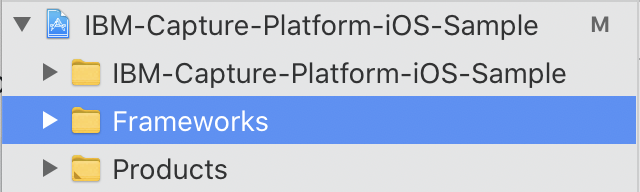
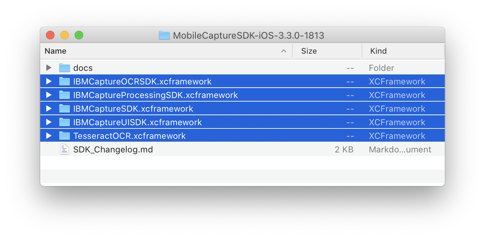
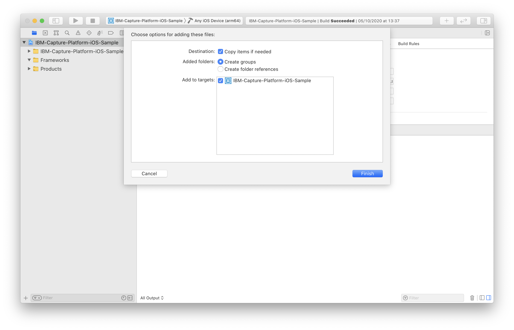
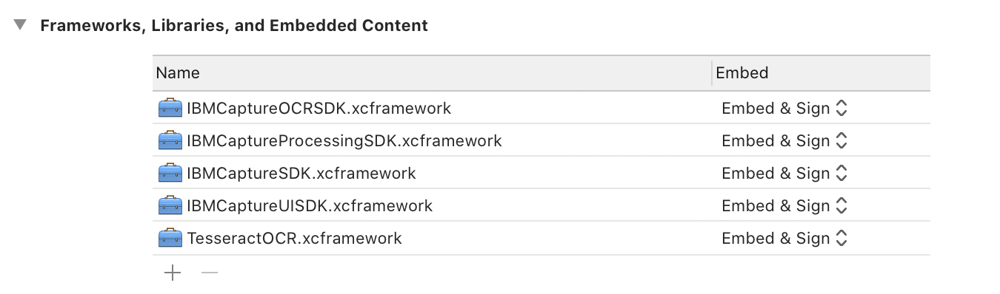

# Mobile Capture SDK - Developer Guide

## About

The Mobile Capture SKDs are a set of native iOS frameworks that help you to integrate *IBM Automation Mobile Capture* in your existing mobile app or to create a highly customized application from scratch.


## Table of contents
- [Requirements](#requirements)
- [Integration](#integration)
- [Capture](#capture)
    - [Example](#example)
- [Authentication](#authentication)
- [Download Data](#download-data)
- [Upload Results](#upload-results)

## Requirements

The Mobile Capture SDKs require iOS 13 or later as the minimum OS version.

## Integration

The Mobile Capture SDKs are organized in four different `xcframeworks` to help you to pick and choose only the functions that you need without affecting the size of your final application.

The four `xcframeworks`:

- `MobileCaptureSDK`: this SDK contains the models and the network layer. This SDK is required to use any of the other three. 
- `MobileCaptureUISDK`: this SDK contains the `UIViewControllers` used to capture data from the camera and review the results.
- `MobileCaptureProcessingSDK`: This SDK contains the logic to process the captured images and extract data from them. You should **not** be using this SDK directly. You should always use the MobileCaptureUISDK to capture and extract information.
- `MobileCaptureOCRSDK`: This SDK contains the logic to perform OCR for a given image. This SDK requires Tesseract to be present on the project.

To make the Mobile Capture SDKs available to your application, you need to  do the following steps:

1. If you do not have a `Frameworks` group, create one on your project navigator:



2. Drag and drop the needed SDKs to the `Frameworks` group:



3. Make sure to mark "Copy items if needed" on Xcode's dialog:



4. Go to Targets, Select your target, Click General. Make sure that the SDKs that you have dragged appear under `Frameworks, Libraries and Embedded Content` and that they are marked as "Embed & Sign":



    Note:
    1. If the SDKs do not appear under `Frameworks, Libraries and Embedded Content`, simply click on the "+" sign and select all of them from the popup.
    2. If the SDKs appear as "Do Not Embed", make sure to change it to "Embed & Sign".

5. Now you are ready to use them in your code.You  have to import what you need, for example:

```swift
import IBMCaptureSDK
import IBMCaptureUISDK
import IBMCaptureOCRSDK
```

## Capture

To capture information, you must use the `IBMCaptureUISDK` and choose the appropriate `UIViewController` for your needs. All these `UIViewController`s require that you inject a `Step` on the `init`. Since the required `Steps are protocols, you can conform to the needed protocol with your own custom implementation if you are not connecting to a server that would return you the correct instances.

- **US Driver’s License**: Used to capture the front and back of a US driver’s license. The `UIViewController` needed is called `USDLCaptureViewController`. To instantiate this `UIViewController` you must pass an instance that conforms to `USDLCaptureStep`. When the user finished capturing the front and the back of the US driver’s license, the `completion` will be called with the output of the operation. It contains the front image, the back image and the extracted data.

- **Passport**: Used to capture a passport. The `UIViewController` needed is called `PassportCaptureViewController`. To instantiate this `UIViewController` you must pass an instance that conforms to `PassportCaptureStep`. When the user finished capturing the passport and the data extraction was successful, the `completed` call-back is  called with the output of the operation. It contains the image and the extracted data.

- **Barcode**: Used to capture a barcode. The `UIViewController` needed is called `BarcodeCaptureViewController`. To instantiate this `UIViewController` you must pass an instance that conforms to `BarcodeStep`. When the user finishes scanning the barcode, the `detectedBarcode` call-back  is called with the extracted data.

- **Document**: Used to capture a document that can have one or more pages. The `UIViewController` needed is called `MultipageDocumentViewController`. To instantiate this `UIViewController` you' must pass an instance that conforms to `MultipageDocumentCaptureStep`. Every time that the user captures and accepts (if needed) a page, the `capturedImage` call-back is called with the captured image. 

- **Page Inspector**: Used to capture a page from a document. The `UIViewController` needed is called `DocumentCaptureViewController`. To instantiate this `UIViewController` you must pass an instance that conforms to `ZonedDocumentCaptureStep`. When the user finished capturing the page of the document, the `capturedImages` call-back is called containing the original image and the processed one.

- **Photo**: Used to capture a photo. The `UIViewController` needed is called `PhotoCaptureViewController`. To instantiate this `UIViewController` you must pass an instance that conforms to `PhotoCaptureStep`. Every time that the user captures an image, the `capturedImage` call-back is called with the captured image.

As you might have noticed, most of these `UIViewControllers` have a parameter on the `init` that accepts a `UIViewController` that conforms to `IBMCaptureUISDK.ImageReviewer`. By default, implementation is used `ImageReviewViewController`, but you can provide your own custom implementation if you need further customization for the accept/reject screen.

### Example

To make the implementation easier, see the following example of how you would capture a Passport. The other `UIViewController`s behave similarly:

```swift
// If you're not connecting to the server you'll have to add your own
// implementation that conforms to `PassportCaptureStep`. Otherwise,
// you'll be able to get the correct `Step` from the `Scenario` that
// you're currently using.
let passportStep: PassportCaptureStep = YourPassportStepImplementation()
let passportViewController = PassportViewController(step: passportStep)
passportViewController.completed = { output in
    // Do whatever you need with the image & data
    let image = output.image
    let data = output.extractedData
}
present(passportViewController, animated: true)
```

## Authentication

To authenticate against a server, need to create a `NetworkRequestBuilder`. After you have an instance of it, you can  call the `IMCNetworkRequestBuilder.authenticate(with:completion:)` method. The parameter required for that method must be a `NSURLCredential.init(user:password:persistence:)` that has the username (email) and password of the user that is trying to log in.

After the request is done, the `completion` is called, either with a `session` or an `error`. The `session` returned is a `JSON` containing all the user information. You need this `session` if you want to keep the user logged in, therefore, you should store the session in the Keychain to be retrieved later. `IMCNetworkRequestBuilder.init(baseURL:sessionState:)` is the method that you want to use if you wish to keep the user logged in, passing in the `session` that you saved  in the Keychain.


## Download Data

By using `NetworkRequestBuilder`,which you had previously created, you need to create a `Requester`. You can do so though the `IMCRequesterFactory.persistentRequester(with:fileManager:persistenceBaseURL:)` factory method. Keep this `Requester` around because you are going to use for all the requests.

The `Requester` helps you to perform the following requests to retrieve data:

- Fetch all scenarios: To retrieve all available scenarios, you must call `IMCRequester.scenariosRequest()`. The scenarios contains the basic information, to fetch all the information available you must fetch one by one, as explained in the point below.
- Fetch a scenario based on the ID: To retrieve the details of a scenario, you must call `IMCRequester.scenarioRequest(with:)`. Once this request is completed, the scenario can have all the information available.
- Fetch all sessions: To retrieve the sessions, you must call `IMCRequester.sessionsRequest()`.
- Fetch a session based on the ID: To retrieve a single session, you must call `IMCRequester sessionRequest(with:)`.

All this requests work the same way, see the following example on how to fetch all available scenarios:

```swift
let scenariosRequest = self.requester.scenariosRequest()
        
scenariosRequest.completion { [weak self] in
    let scenarios = scenariosRequest.entities.compactMap { $0 as? Scenario }
}

scenariosRequest.error { error in
    assertionFailure("Failed to download the scenarios: \(error.localizedDescription)")
}

scenariosRequest.execute()
```

The `entities` property of a `Request` is  populated once the completion is called. If you try to access that property before the `completion` is called, the array is empty. Make sure, to explore the available methods on `Request` because there are equivalent methods for an `NSFetchedResultsController`. In case that you want to display the scenarios on a `UI{Table/Collection}View`, progress, success, etc.

## Upload Results

When you completed capturing and extracting data, you might want to upload all the information to the server. To do that, you must use an `IMCUploadManager`. You need not to create one manually,  the `Requester` that you keep around has a property called `uploadManager` that you are going to use to send the data to the server.

The `UploadManager` handles the uploads internally, retrying them when they fail. The method to enqueue an upload is `UploadManager.uploadRequest(with:stepFiles:propertyValueContainers:sessionId:)`, review the parameters required by this method:

- `scenario`: The `Scenario` for which you are doing this upload.
- `stepFiles`:  To know which captures belong to which `Step`, we need a way to relate them to one another. That achieves by using `StepFiles`. You can create this objects just before uploading. You can notice that the `init` of the `StepFile` asks for a `Step` and an array of `URL`s. That's because a `Step` can have multiple captures, and such captures need to be saved on disk.
- `propertyValueContainers`: It behaves similarly to the `stepFiles`, it is a relationship between a `Property` and the value that was extracted. You can also create this before uploading, even though it is recommended to create it when you are extracting data and keep it around until the upload time.
- `sessionId`: If you already have a `Session` that you want to upload the data to, pass the ID here that  is used for that. If you do not pass the `sessionId`, a new `Session` is  created.
